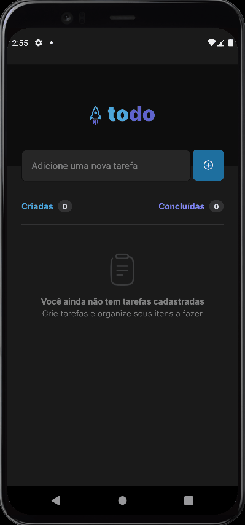
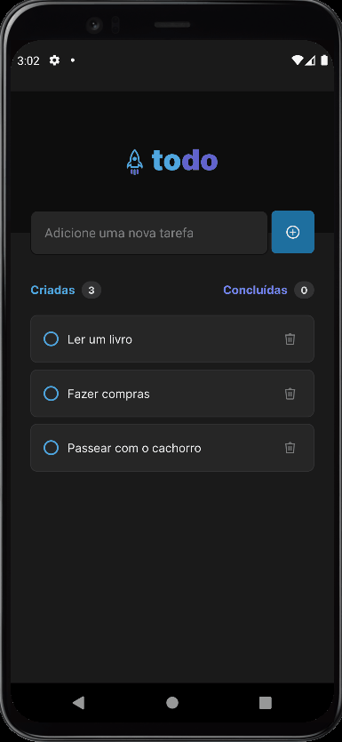
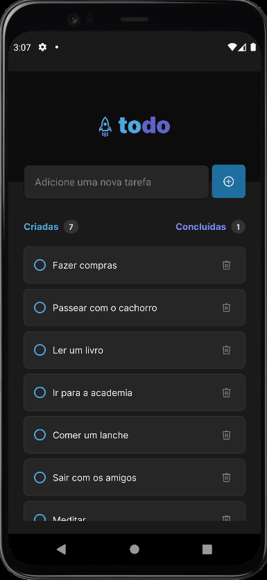

<br /><br />
<h4 align="center">

</h4>
<br /><br />

# About 💡

React Native ToDo List app from Rocketseat's React Native Ignite challenge.

# You Need 📃

* **Node.js** -- v16.10.0
* ExpoGo App installed on your smartphone

# Running ⚙

* Clone this repository**
* Inside the project's root folder, run:

```bash
npm i
npm run start
```

* or (with yarn):

```bash
yarn
yarn start
```

* or even (with npx):

```bash
npm i
npx expo start
```

* Now you have expo running!
* Open Expo Go on your smartphone
* Touch on Scan QRCode
* Scan the QRCode on your terminal
* Done!

# Features 📌

<div align="center">
  <div style="display: grid; grid-template-columns: repeat(auto-fit, minmax(300px, 1fr)); gap: 24px">
    <div>
      <p><strong>Add ➕</strong></p>
      
    </div>
    <div>
      <p><strong>Check ✔</strong></p>
      
    </div>
    <div>
      <p><strong>Delete ❌</strong></p>
      
    </div>
  </div>
</div>

# Technologies 💻

* Expo
* React-Native
* Typescript